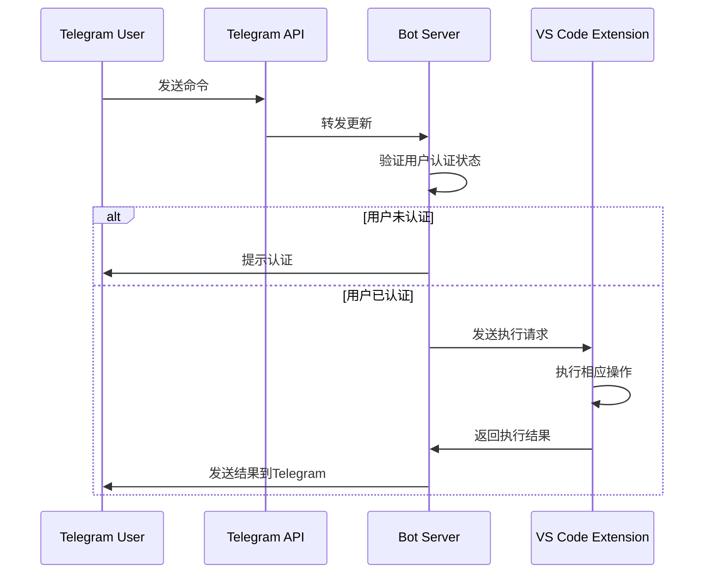

# 系统架构设计

本文档描述了Telegram机器人与VS Code集成系统的整体架构设计。

## 整体架构

系统分为三个主要部分：

1. **Telegram Bot Server**: 处理来自Telegram的消息，验证用户身份，并转发请求到VS Code扩展
2. **VS Code Extension**: 在VS Code环境中执行任务、运行代码和管理文件
3. **通信协议**: 定义两部分之间的通信格式和安全机制

## 组件交互流程

## 安全模型

- JWT令牌认证机制
- 用户权限控制
- 命令白名单验证
- 通信数据加密

## 数据流

1. 用户在Telegram中发送命令
2. Telegram API将消息推送到Bot Server
3. Bot Server验证用户身份
4. 验证通过后，Bot Server向VS Code Extension发送请求
5. VS Code Extension执行相应操作
6. 执行结果返回给Bot Server
7. Bot Server将结果格式化后发送回Telegram用户